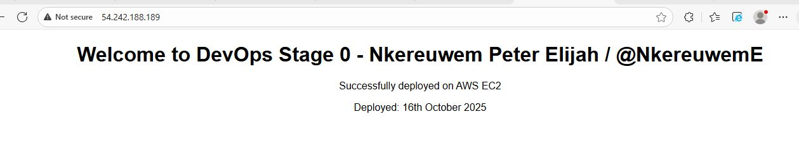

# HNG13 Stage 0 - DevOps Project 🚀

  
  
  

## Project Overview
This project sets up and deploys an **NGINX web server** that serves a custom webpage.  
It demonstrates fundamental deployment skills and the ability to work with server setups in a cloud environment.

## Web Server Screenshot

## Tools & Technologies
  
  
  
  

## Project Status
> **Note:** The EC2 instance used in this project may no longer be active.  
> This repository is maintained for **portfolio and demonstration purposes** only.

---

Nkereuwem Elijah – DevOps & Cloud Portfolio  
Email: [Nkereuwemelijah@gmail.com](mailto:Nkereuwemelijah@gmail.com)  
[LinkedIn](https://www.linkedin.com/in/npelijah/) • [GitHub](https://github.com/nkereuwemelijah)

