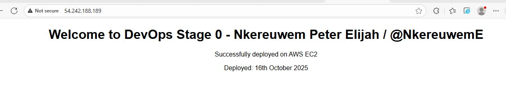

# HNG13 Stage 0 - DevOps Project

## 🚀 Project Overview
This project sets up and deploys an **NGINX web server** that serves a custom webpage as part of the **HNG13 Stage 0 DevOps challenge**.  
It demonstrates basic deployment skills and the ability to work with server setup and file hosting.

## 🖼️ Web Server Screenshot

## 📝 Project Status
> **Note:** The EC2 instance used in this project may no longer be active.  
This repository is maintained for **portfolio and demonstration purposes** only.

## 📌 Contact
- Slack: [@NkereuwemE](https://hng.slack.com/team/NkereuwemE)
