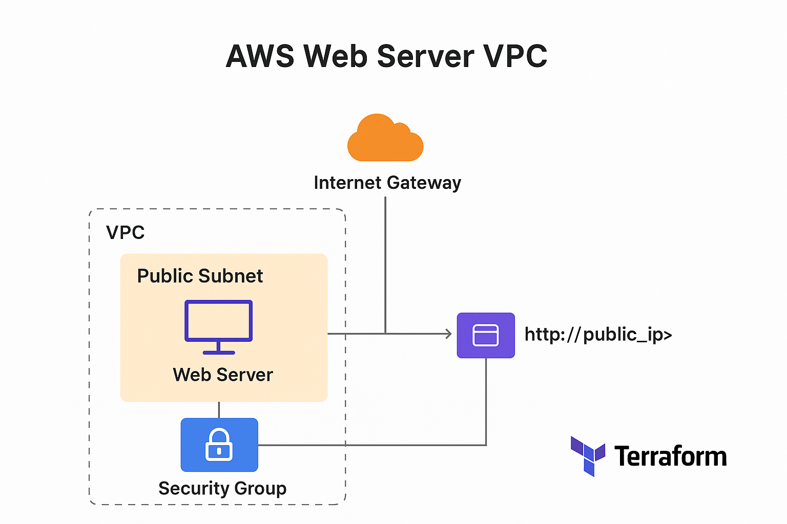

# AWS Web Server VPC Terraform Project

This project demonstrates a complete AWS environment deployed via Terraform:

- VPC with public subnet
- Internet Gateway and Route Table
- Security Group allowing SSH & HTTP
- EC2 instance running a basic web server

## 🧠 Learning Objectives
- Understand how Terraform provisions AWS resources  
- Learn how to configure VPC, Subnet, Route Table, and EC2 instance  
- Practice initializing, applying, and destroying Terraform infrastructure  
- Gain hands-on Git and GitHub workflow experience

## 📂 Project Tree Structure
```plaintext
nkereuwemelijah-portfolio/
└─ terraform-projects/
   └─ aws-webserver-vpc/
      ├─ main.tf           # Main Terraform configuration
      ├─ variables.tf      # Variables for customization
      ├─ outputs.tf        # Output values like EC2 IP
      ├─ provider.tf       # AWS provider configuration
      ├─ README.md         # This README
      └─ diagram.png       # Architecture diagram
```

## 🖼️ Architecture Diagram


> **Diagram Description:**  
> The VPC contains a public subnet with an Internet Gateway. A Security Group allows SSH and HTTP access. The EC2 instance hosts a basic web server accessible over the internet.

## ⚙️ Usage & Workflow

1. Clone the repository:
git clone https://github.com/nkereuwemelijah/nkereuwemelijah-portfolio.git
cd terraform-projects/aws-webserver-vpc

2. Git workflow
# Initialize a new Git repository (if not already initialized)
git init                

# Format Terraform code (optional, if you have a formatter installed)
git fmt                 

# Stage all changes for commit
git add .               

# Commit changes with a descriptive message
git commit -m "Update project files"

3. Terraform workflow
# Validate the Terraform configuration for syntax errors
terraform validate      

# Preview the changes Terraform will make in AWS
terraform plan          

# Apply the Terraform plan and create resources in AWS
terraform apply         

# Destroy the AWS infrastructure when done
terraform destroy       

## 📝 Project Status
> **Note:** The EC2 instance used in this project may no longer be active.  
> This repository is maintained for portfolio and demonstration purposes only.

